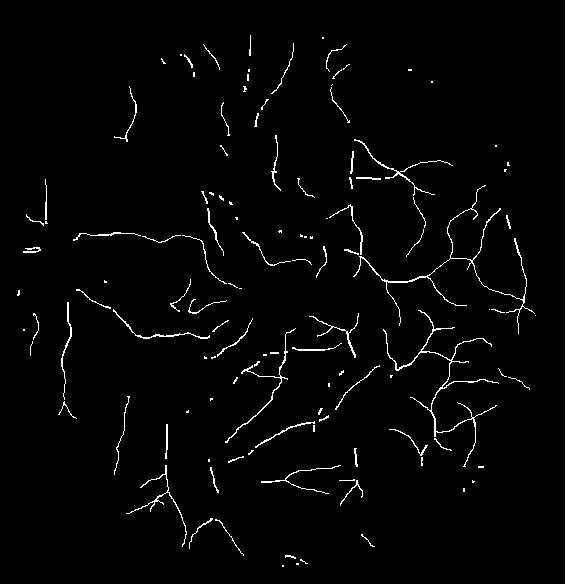
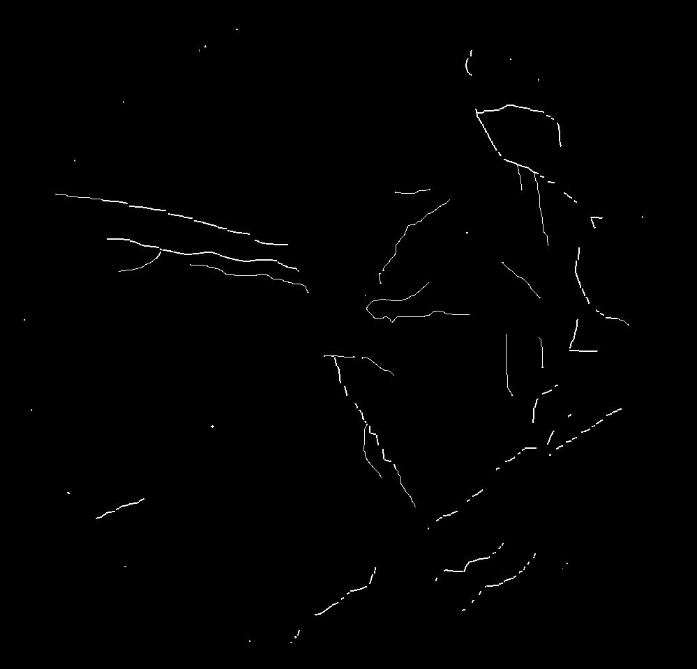

# retinal_thin_vessels

A Python package for computing segmentation metrics specifically on thin vessels in retinal images, as detailed in our paper: {LINK TO YOUR PAPER}.

## How to install the package

```bash
pip install retinal_thin_vessels
```

## Functions demonstrations using DRIVE and CHASEDB1

This package offers functions for computing the recall and precision metrics on thin vessels. However, it's necessary to understand the ground truth these functions consider, in order to give these metrics reliability. Therefore, we offer, aswel, a function that returns the filtered mask when passed a segmentation mask. Below, the code for generating this masks using three diferent public datasets: DRIVE, CHASEDB1 and FIVES is shown in order to exemplify the usage of this package. 

```python
from PIL import Image
from retinal_thin_vessels.core import get_thin_vessels
from sklearn.metrics import recall_score, precision_score
```

```python
# Imports the original segmentation masks
seg_DRIVE = Image.open(f"tests/imgs/DRIVE_seg_example.png")
seg_CDB1 = Image.open(f"tests/imgs/CHASEDB1_seg_example.png")

# Gets the filtered masks with only thin vessels
thin_vessels_seg_DRIVE = get_thin_vessels_mask(seg_DRIVE)
thin_vessels_seg_CDB1 = get_thin_vessels_mask(seg_CDB1)

# Displays the image
img = Image.fromarray(thin_vessels_seg_DRIVE)
img.show()
img = Image.fromarray(thin_vessels_seg_CDB1)
img.show()

```
|:-----------------------------------------------------------------:|
||
||

Furthermore, to check that the computation of the metrics is working, you can run the code below:

```python

```
